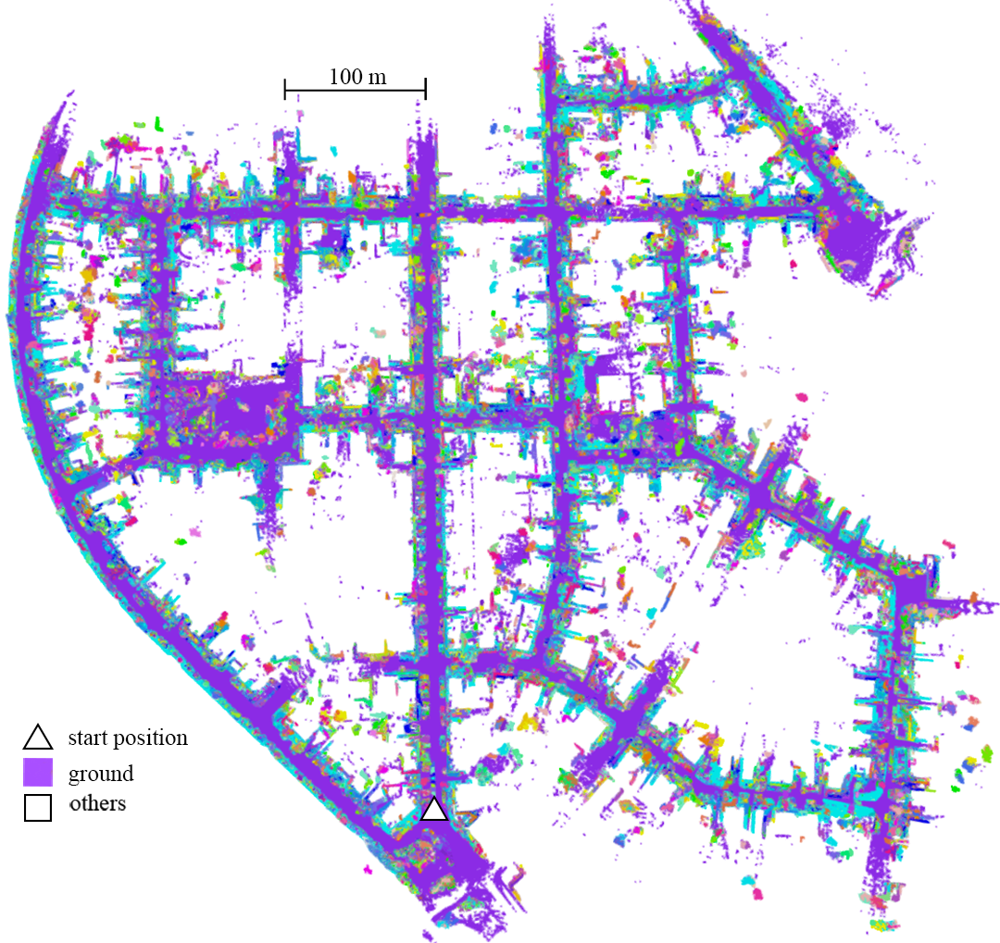
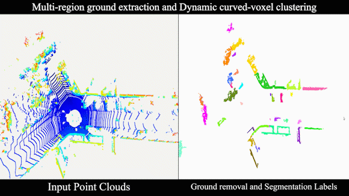
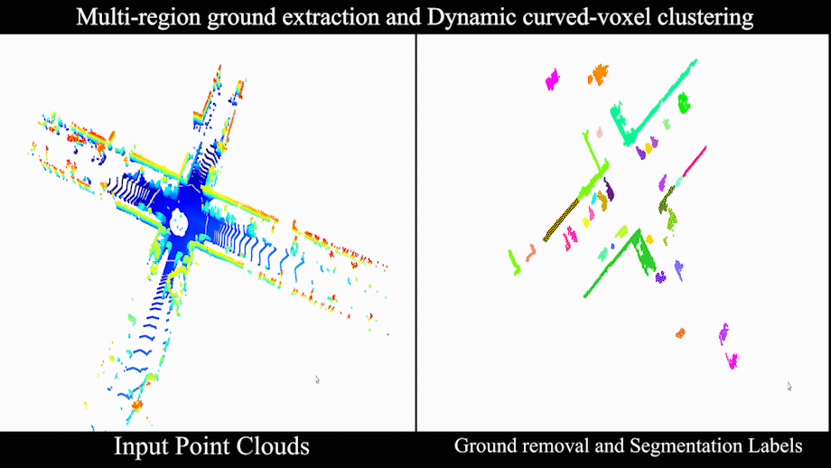
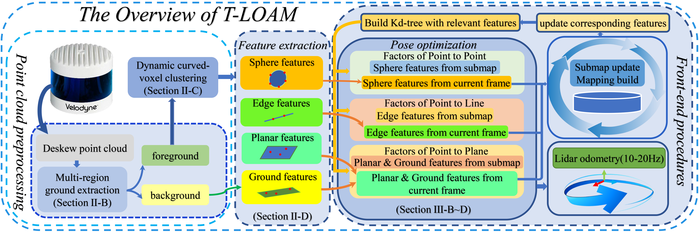
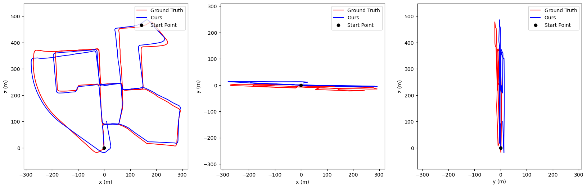
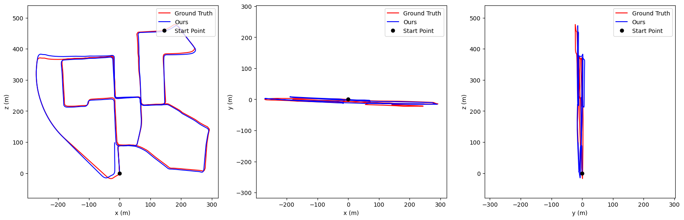
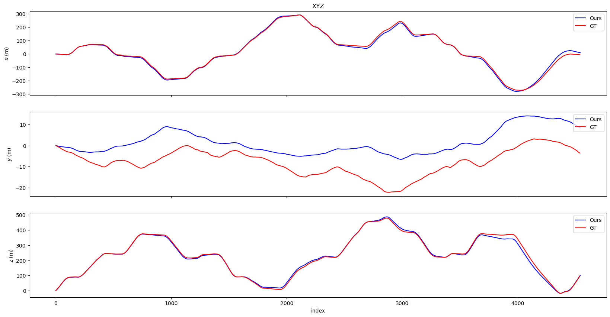
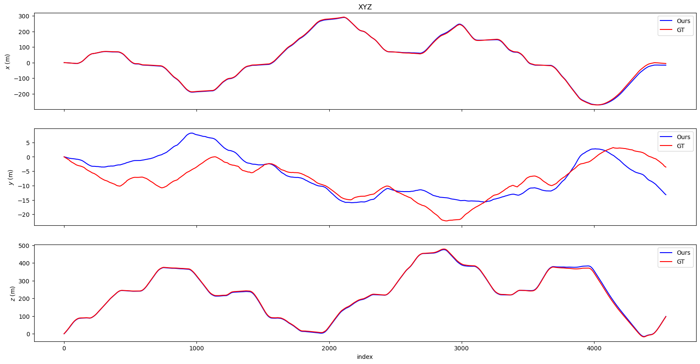
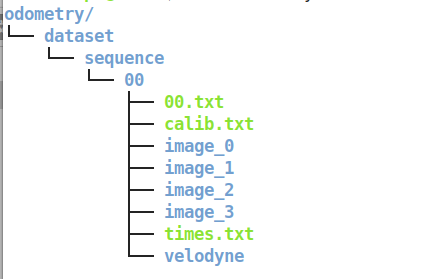

## T-LOAM: Truncated Least Squares Lidar-only Odometry and Mapping in Real-Time

**The first Lidar-only odometry framework with high performance based on truncated least squares and Open3D point cloud library, The foremost improvement include:** 

* **Fast and precision pretreatment module, multi-region ground extraction and dynamic curved-voxel clustering perform ground point extraction and category segmentation.**
* **Feature extraction based on principal component analysis(PCA) elaborate four distinctive feature，including: planar features, ground features, edge features, sphere features**
* **There are three kinds of residual functions based on truncated least squares method for directly processing above features which are point-to-point, point-to-line, and point-to-plane.**
* **Open3d point cloud library is integrated into SLAM algorithm framework for the first time. We extend more functions and implemented the message interface related to ROS.**
#### [[Demo Video](https://youtu.be/YwINGyaRXVQ)] [[Preprint Paper](https://doi.org/10.1109/TGRS.2021.3083606)] 

<p align='center'>
	
</p>
<p align='center'>
	
	
	
	
</p>

**Note that regard to pure odometry without corrections through loop closures, T-LOAM delivers much less drift than [F-LOAM.](https://github.com/wh200720041/floam)** 

## Framework overview

<p align='center'>
	
</p>

Each frame of the 3D LiDAR is processed as input. Four main processing modules are introduced to construct the backbone of the algorithm: (a) multi-region ground extraction module, (b) dynamic curved-voxel clustering module, (c) feature extraction module, (d) pose optimization module. 

## Evaluation

|   KITTI Sequence 00    | F-LOAM | T-LOAM |
| :--------------------: | :----: | :----: |
| Translational Error(%) |  1.11  |  0.98  |
| Relative Error(°/100m) |  0.40  |  0.60  |

### Graphic Result(Path and Translation)

#### F-LOAM

<p align='center'>
	
</p>

#### T-LOAM

<p align='center'>
	
</p>

#### F-LOAM

<p align='center'>
	
</p>

#### T-LOAM

<p align='center'>
	
</p>


## Dependency

-[ROS](https://www.ros.org/install/)(Melodic Ubuntu18.04)

```bash
sudo apt-get install python-catkin-tools ros-melodic-ecl-threads ros-melodic-jsk-recognition-msgs ros-melodic-jsk-visualization ros-melodic-velodyne-msgs
```

-[YAML](https://github.com/jbeder/yaml-cpp/releases)(0.6.3)  Note that you must build a shared library due to we utilize the ros nodelet package.

```bash
tar -zxvf yaml-cpp-yaml-cpp-0.6.3.tar.gz
cd yaml-2.3.0 && mkdir build && cd build
cmake [-G generator] [-DYAML_BUILD_SHARED_LIBS=ON] ..
make 
sudo make install
```
-[Open3D](http://www.open3d.org/)(A Modern Library for 3D Data Processing 0.12.0)

Please note that open3d installation will be a slightly troublesome process, please be patient. Another problem that needs attention is that Open3D-ML cannot be used in ROS at the same time due to the link [error2286](https://github.com/intel-isl/Open3D/issues/2286) and [error3432](https://github.com/intel-isl/Open3D/issues/3432). In order to fix this, you need to specify the cmake flag `-DGLIBCXX_USE_CXX11_ABI=ON`. However, the latest Tensorflow2.4 installed through conda(not pip) already supports the C++11 API, you can check the API with `print(tensorflow.__cxx11_abi_flag__)`. If the flag is true, you can set the compile flag `-DBUILD_TENSORFLOW_OPS=ON`  Next, you can complete the installation according to the [instructions](http://www.open3d.org/docs/release/compilation.html#)

```bash
cd Open3D
util/scripts/install-deps-ubuntu.sh
mkdir build && cd build 
cmake \
    -DBUILD_SHARED_LIBS=ON \
    -DPYTHON_EXECUTABLE=$(which python3) \
    -DBUILD_CUDA_MODULE=ON \
    -DGLIBCXX_USE_CXX11_ABI=ON \
    -DBUILD_LIBREALSENSE=ON  \
    -DCMAKE_BUILD_TYPE=Release \
    -DCMAKE_INSTALL_PREFIX=/usr/local \
    -DBUILD_PYTORCH_OPS=OFF \
    -DBUILD_TENSORFLOW_OPS=OFF \
    -DBUNDLE_OPEN3D_ML=ON \
    -DOPEN3D_ML_ROOT=${replace with own Open3D-ML path} \
    ../
make -j4
sudo make install 
```
If you have clone problems, you can download it directly from the link below.

[Baidu Disk](https://pan.baidu.com/s/1SLXcHEy98TuykWbnzrQIYg) code: khy9 or [Google Drive](https://drive.google.com/file/d/1EYdIFMOIMtft5IOCdxdnX0N90XzVy9cE/view?usp=sharing) 

-[Ceres Solver](http://ceres-solver.org/)(A large scale non-linear optimization library 2.0)
you can complete the installation according to the [guide](http://www.ceres-solver.org/installation.html)

## Installation 
Now create the Catkin Environment:
```bash
mkdir -p ~/tloam_ws/src
cd ~/tloam_ws
catkin init
catkin config --merge-devel
catkin config --cmake-args -DCMAKE_BUILD_TYPE=Release
```
And clone the project:
```bash
cd src
git clone https://github.com/zpw6106/tloam.git
catkin build
```
 ## Usage

Download the [KITTI Odometry Dataset](http://www.cvlibs.net/datasets/kitti/eval_odometry.php) ([Graviti](https://gas.graviti.cn/dataset/hello-dataset/KITTIOdometry) can provide faster download speed in China), then organize it according to the following structure, and modify the read path in the config/kitti/kitti_reader.yaml

<p align='center'>
	
</p>

 -Example for running T-LOAM using the KITTI Dataset
```
roslaunch tloam tloam_kitti.launch
```
## Contributors
Pengwei Zhou (Email: [zpw6106@gmail.com](zpw6106@gmail.com))
## BibTex Citation
Thank you for citing our T-LOAM paper on [IEEE](https://ieeexplore.ieee.org/document/9446309)if you use any of this code: 
```
@ARTICLE{9446309,
  author={Zhou, Pengwei and Guo, Xuexun and Pei, Xiaofei and Chen, Ci},
  journal={IEEE Transactions on Geoscience and Remote Sensing}, 
  title={T-LOAM: Truncated Least Squares LiDAR-Only Odometry and Mapping in Real Time}, 
  year={2021},
  volume={},
  number={},
  pages={1-13},
  doi={10.1109/TGRS.2021.3083606}
  }
```

## Credits

We hereby recommend reading [A-LOAM](https://github.com/HKUST-Aerial-Robotics/A-LOAM) ,[floam](https://github.com/wh200720041/floam) and  [TEASER](https://github.com/MIT-SPARK/TEASER-plusplus)  for reference and thank them for making their work public.

## License
The source code is released under [GPLv3](http://www.gnu.org/licenses/) license.

I am constantly working on improving this code. For any technical issues or commercial use, please contact me(zpw6106@gmail.com).


